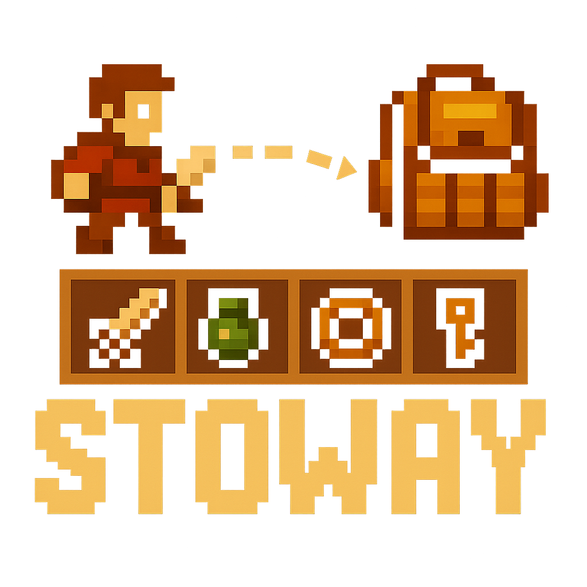

# Stoway - Build 1.x.x 🎒✨
 

 <strong>Stoway</strong> is a flexible and feature-rich inventory and hotbar system designed for Roblox experiences. It provides developers with a robust framework to manage player items, offering deep customization for various gameplay needs, from simple backpacks to complex, data-driven inventories. Please consider going to the <a href="https://github.com/Zyn-ic/Stoway/releases">latest release</a> and downloading it there if you want a view at a basic set up.

 

# Warning

This is a work in progress branch and is not yet ready for production use. It is recommended to use this system as a reference for your own inventory system. This branch covers a complete rewrite from the old server system and is using the Fusion framework to help with the client system to have near instant update times. This branch is not recommended for use in a production environment, please refer to the main branch for code that might come from this branch but download from <a href="https://github.com/Zyn-ic/Stoway/releases">latest release</a> for stable production ready code.

# Documentation

Please refer to the <a href="https://Zyn-ic.github.io/Stoway">github pages</a> for documentation.

# Credits

1.   [**HowToRoblox**](https://www.youtube.com/watch?v=kqa4u_9mSTQ&list=WL&index=6) - sourced a lot of core mechanics from him for backpack/hotbar.
2.  [**Knineteen19**](https://www.youtube.com/watch?v=d2tdaRmqGXI&list=WL&index=8) - his series helped me get a good understanding for inventory/hotbar, presistance, and stacking.
3.  [**Avafe**](https://devforum.roblox.com/t/neohotbar-a-modern-customizable-backpack/2738850) - learned about the existance of [fusion and react](https://www.youtube.com/watch?v=OHqMLEL5QnY&t=1730s) on roblox from this custom hotbar and backpack system.