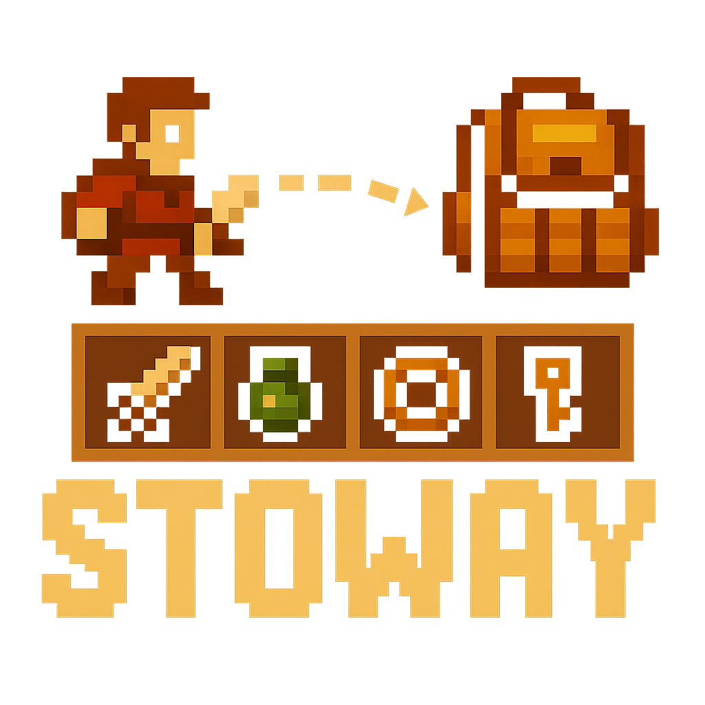

# Stoway - Advanced Roblox Inventory System (V2.4.1)


<div style="display:flex; flex-direction:column; gap:2px;">
<p><strong>Stoway</strong> is a data-driven inventory and hotbar framework for Roblox. It uses <strong>Fusion</strong> for reactive UI, server-authoritative inventory state, and delta replication for efficient updates. Use it as a base for RPG, survival, or utility-heavy inventory systems.</p>
<p>Download the latest packaged release from <a href="https://github.com/Zyn-ic/Stoway/releases">Releases</a>.</p>
</div>

<br>

## Table of Contents
- [Features](#features)
- [Getting Started](#getting-started)
- [Configuration](#configuration)
- [Debug Commands](#debug-commands)
- [Documentation](#documentation)
- [Credits](#credits)

## Features
### Hotbar
- Drag and drop between hotbar and storage.
- Supports static slots and dynamic display behavior.
- Keybind support for quick equip.

### Storage
- Items are tracked as data (UUID-based), not persistent tool instances.
- Configurable stacking, limits, sorting, and filtering.
- Optional backpack enable/disable modes.

### Systems
- Reactive UI with Fusion.
- Server-authoritative state with delta replication and correction sync paths.
- Console mode support, selection mode, and drop UI.
- Multi-skin UI support via settings.

## Getting Started
1. Download the latest `.rbxm` from [Releases](https://github.com/Zyn-ic/Stoway/releases).
2. Place server module(s) in `ServerScriptService`.
3. Place client module(s) in `StarterPlayerScripts`.
4. Place shared modules (`Settings`, `Types`, `RarityValues`, `Binds`) in `ReplicatedStorage/Shared`.
5. Ensure required packages (such as Fusion) are available in `ReplicatedStorage/Packages`.
6. Initialize on server:

```lua
local StowayServer = require(game.ServerScriptService.StowayServerV1_2)
StowayServer.Init()
```

## Configuration
Primary settings are in `src/shared/Settings.luau`.

```lua
local Settings = {}

Settings.Hotbar = {
    Type = "Static", -- "Static" | "Dynamic"
    MaxSlots = 10,
}

Settings.Storage = {
    Limit = 15,        -- 0 = infinite
    CanStack = true,
    Sorting = true,
    MaxStackSize = 5,
    BackpackEnabled = true,
    SortOrder = "None" -- "None" | "Name" | "Rarity" | "ItemType"
}

Settings.Gameplay = {
    Droppable = true,
    DropDistance = 10,
    MouseScroll = true,
}

return Settings
```

## Debug Commands
Built-in chat commands for testing (do not leave unrestricted in production):
- `/inv`
- `/add [itemId] [amount?]`
- `/addback [itemId] [amount?]`
- `/remove [uuid] [amount?]`
- `/swap [Hotbar/Storage] [slot] [Hotbar/Storage] [slot]`
- `/drop [Hotbar/Storage] [slot] [amount?]`
- `/set_limit [n]`
- `/set_hotbar_slots [n]`
- `/setui [UiType]`

## Documentation
Full docs: [https://zyn-ic.github.io/Stoway/](https://zyn-ic.github.io/Stoway/)

## Credits
1.   [**HowToRoblox**](https://www.youtube.com/watch?v=kqa4u_9mSTQ&list=WL&index=6) - sourced a lot of core mechanics from him for backpack/hotbar in my ealier versions.
2.  [**Knineteen19**](https://www.youtube.com/watch?v=d2tdaRmqGXI&list=WL&index=8) - his series helped me get a good understanding for inventory/hotbar, presistance, and stacking.
3.  [**Avafe**](https://devforum.roblox.com/t/neohotbar-a-modern-customizable-backpack/2738850) - learned about the existance of [fusion and react](https://www.youtube.com/watch?v=OHqMLEL5QnY&t=1730s) on roblox from this custom hotbar and backpack system.
4.  [**Illusion**](https://devforum.roblox.com/t/illusions-inputactionsystem-currently-the-best-input-manager/4071242) for creating a module around roblox's new InputActionService *thank you this saved me a lot of time* 😭
