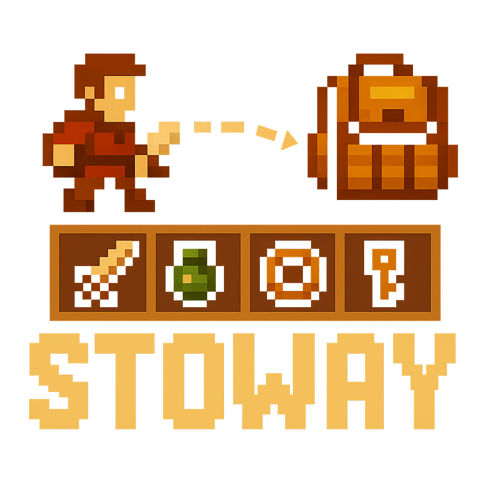

# Stoway - CoreStore


<div style="display:flex; flex-direction:column; gap:2px;">
<p><strong>Stoway</strong> 
is a full inventory system split into independent layers. Each layer is built in its own branch so it can be developed, tested, and maintained separately.

```
Stoway
├── CoreStore          ← pure Luau inventory engine (this branch)
├── Network Layer      ← delta replication, anti-exploit locking
├── World Layer        ← Tool spawning, equipping, dropping
└── Client Layer       ← UI rendering, drag-and-drop, hotbar visuals
```

The layers talk to each other in one direction:

```
Client Layer → Network Layer → CoreStore ← World Layer
```

<i>CoreStore owns the inventory truth. Everything else reads from it or writes to it through its public API.</i> <br>
Download the latest packaged release from <a href="https://github.com/Zyn-ic/Stoway/releases">Releases</a>.
</p>
</div>

<br>

## What This Branch Focuses On

This branch builds **CoreStore** the pure Luau inventory engine.

CoreStore is:

- **Pure Luau** &rarr; no Roblox types, no `Instance`, no `Player`, no `RemoteEvent`
- **Fast lookups** &rarr; O(1) item access by UUID, by ItemId, by slot, by metadata
- **Testable outside Roblox** &rarr; runs in Lune, Luau CLI, or any Luau environment
- **Framework-agnostic** &rarr; works with any networking, any UI, any tool system

CoreStore is **not**:

- A networking layer
- A client UI
- A drag-and-drop system
- A Tool spawner
- A DataStore adapter

Those are separate layers. They will live in their own branches.

## CoreStore API

```luau
local state = CoreStore.new(settings)

-- Add items
CoreStore.add(state, { Id = "Sword", Amount = 1, Metadata = { Rarity = "Common" } })
CoreStore.addToBackpack(state, itemData)
CoreStore.addToHotbar(state, itemData, slot)
CoreStore.addToSlot(state, itemData, { Type = "Hotbar", Slot = 3 })

-- Remove items
CoreStore.remove(state, uuid, amount)
CoreStore.removeBySlot(state, "Hotbar", 1, amount)

-- Move items
CoreStore.swap(state, fromRef, toRef)
CoreStore.move(state, fromRef, toRef)
CoreStore.split(state, uuid, amount, destination)

-- Query items
CoreStore.getItem(state, uuid)
CoreStore.find(state, { Id = "Sword", Metadata = { Rarity = "Legendary" } })
CoreStore.filter(state, predicate)
CoreStore.findById(state, "Sword")
CoreStore.getAllItems(state)

-- Metadata
CoreStore.updateMetadata(state, uuid, { Rarity = "Legendary", Damage = 50 })

-- Sorting
CoreStore.sort(state)

-- Settings
CoreStore.setHotbarType(state, "Dynamic")
CoreStore.setSettings(state, overrides)
```

Every operation returns a result object with `success`, `error` (if failed), and operation-specific data (items added, amount removed, overflow, etc).

## State Shape

```luau
{
    Items = { [uuid] = Item },              -- O(1): UUID → Item
    ItemsByID = { [id] = { uuid } },       -- O(1): ItemId → all UUIDs
    Hotbar = { uuid?, ... },                -- fixed slots (Static) or packed (Dynamic)
    Storage = { uuid, ... },                -- packed array, no holes
    LocationByUUID = { [uuid] = SlotRef },  -- O(1): UUID → slot position
    MetadataIndex = {                       -- O(1): metadata field → value → UUIDs
        Rarity = { Common = { uuid }, ... },
        Type = { Weapon = { uuid }, ... },
    },
    EquippedItemUUID = uuid?,
    Weight = number,
    Settings = { ... },
}
```

## Key Behaviors

- **Stacking** &rarr; via `add` (always) or `swap` with `StackOnSwap = true`. Move and split never stack.
- **Capacity** &rarr; `Limit = 0` means infinite. `Weight` = sum of all item Amounts.
- **Sorting** &rarr; auto-sorts Storage when `Settings.Sorting = true`. Hotbar is never sorted.
- **Dynamic Hotbar** &rarr; packed array, no holes. Operations targeting non-append slots are rejected.
- **MetadataIndex** &rarr; O(1) bucket lookups for `find()` by Rarity or Type.
- **MaxStackSize** &rarr; enforced unconditionally. No item Amount may exceed it after any operation.

## Running Tests

### Luau (primary)

```
luau.exe "src/server/tests/corestore_operations_test.luau"
luau.exe "src/server/tests/corestore_addtest.luau"
```

### Lune (REPL-style)

```
lune.exe "src/server/tests/manual_test.luau"
```

### Web Test Tool

Open `src/server/tests/web/index.html` in a browser. Full JS port of CoreStore with 12 test scenarios and drag-and-drop.

## Credits

1. [**HowToRoblox**](https://www.youtube.com/watch?v=kqa4u_9mSTQ&list=WL&index=6) - sourced core backpack/hotbar mechanics from earlier versions.
2. [**Knineteen19**](https://www.youtube.com/watch?v=d2tdaRmqGXI&list=WL&index=8) - series on inventory/hotbar, persistence, and stacking.
3. [**Avafe**](https://devforum.roblox.com/t/neohotbar-a-modern-customizable-backpack/2738850) - learned about Fusion and reactive UI patterns.
4. [**Illusion**](https://devforum.roblox.com/t/illusions-inputactionsystem-currently-the-best-input-manager/4071242) - InputActionSystem module.
