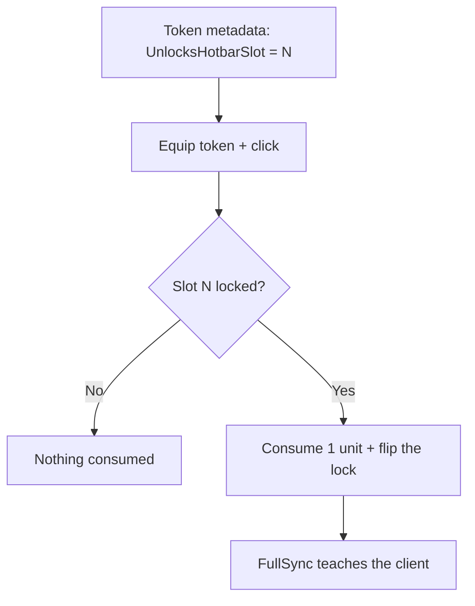

# Stoway - Locked Slots


<div style="display:flex; flex-direction:column; gap:2px;">
<p><strong>Stoway</strong> 
is a full inventory system split into independent layers. Each layer is built in its own branch so it can be developed, tested, and maintained separately.

```
Stoway
├── master             ← integration branch
├── corestore          ← pure Luau inventory engine
├── server             ← orchestration, networking, world
└── client             ← UI rendering, drag-and-drop (this branch forks it)
```

The layers talk to each other in one direction:

```
Client Layer → Network Layer → CoreStore ← World Layer
```

*CoreStore owns the inventory truth. Everything else reads from it or writes to it through its public API.* <br>
Download the latest packaged release from <a href="https://github.com/Zyn-ic/Stoway/releases">Releases</a>.
</p>
</div>

<br>

## This Branch: Locked Slots

`example/locked-slots` is ABOUT METADATA-KEYED SLOT UNLOCKS — hotbar slots
start locked, and token items unlock them through USE, not possession. A
token carries `UnlocksHotbarSlot = N`; equipping it and clicking consumes one
unit, flips slot N out of `LockedHotbarSlots`, and FullSync teaches the
client permanently. Merely holding the token unlocks nothing.


```mermaid
flowchart TD
    A[Token metadata: UnlocksHotbarSlot = N] --> B[Equip token + click]
    B --> C{Slot N locked?}
    C -->|No| D[Nothing consumed]
    C -->|Yes| E[Consume 1 unit + flip the lock]
    E --> F[FullSync teaches the client]
```

Try it in Studio play (chat commands): `/addhot PouchToken`, equip it,
click → slot 9 unlocks. `/locks` shows per-slot verdicts, `/relock`
re-locks 9. Details in `AGENTS.md` ([showcase section](AGENTS.md#locked-slots-showcase-this-branch)).

## Credits

1. [**HowToRoblox**](https://www.youtube.com/watch?v=kqa4u_9mSTQ&list=WL&index=6) - sourced core backpack/hotbar mechanics from earlier versions.
2. [**Knineteen19**](https://www.youtube.com/watch?v=d2tdaRmqGXI&list=WL&index=8) - series on inventory/hotbar, persistence, and stacking.
3. [**Avafe**](https://devforum.roblox.com/t/neohotbar-a-modern-customizable-backpack/2738850) - learned about Fusion and reactive UI patterns.
4. [**Illusion**](https://devforum.roblox.com/t/illusions-inputactionsystem-currently-the-best-input-manager/4071242) - InputActionSystem module.
5. [**breadboardengineer1234**](https://github.com/breadboardengineer1234/QuickNet) - QuickNet, the drop-in networking library behind Stoway's client/server wire.
